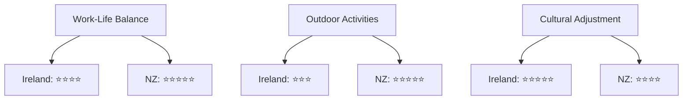

# 🇮🇪 Ireland vs 🇳🇿 New Zealand - Relocation Analysis

## 💼 Professional Landscape

| Aspect | Ireland | New Zealand |
|--------|---------|-------------|
| Tech Scene Size | Large (Dublin-centric) | Medium (Distributed) |
| Your Role Prospects | ⭐⭐⭐⭐⭐ | ⭐⭐⭐⭐ |
| Wife's Role Prospects | ⭐⭐⭐⭐ | ⭐⭐⭐ |
| Salary Expectations | Higher | Moderate |
| Major Tech Companies | Google, Meta, Microsoft | Xero, Weta Digital |

## 🌡️ Climate Comparison Matrix

```
           J  F  M  A  M  J  J  A  S  O  N  D
Dublin     ❄️ ❄️ 🌧️ 🌧️ 🌤️ 🌤️ 🌤️ 🌤️ 🌧️ 🌧️ ❄️ ❄️
Auckland   ☀️ ☀️ 🌤️ 🌤️ 🌧️ 🌧️ 🌧️ 🌧️ 🌤️ 🌤️ 🌤️ ☀️
```
> 🔍 **Cincinnati Reference**: Four distinct seasons with hot summers and cold winters
> - Ireland: Milder, less variation
> - New Zealand: Similar range, reversed seasons

## 💰 Cost of Living Breakdown

### Dublin vs Auckland (Monthly Estimates in USD)
```
Rent (2BR)  |====================| $2500 🇮🇪
            |===============|      $2000 🇳🇿

Utilities   |======|              $200  🇮🇪
            |========|            $250  🇳🇿

Transport   |=========|           $120  🇮🇪
            |============|        $150  🇳🇿
```

## 🎯 Relocation Success Factors

|Factor|Ireland|New Zealand|Winner|
|------|-------|-----------|------|
|Visa Process|Fast-track tech visas|Points-based system|🤝 Tie|
|Job Search|Can interview while visiting|Often requires being there|🇮🇪|
|Time Zone (US)|Similar|Opposite|🇮🇪|
|Housing Availability|Limited|Better|🇳🇿|
|Healthcare Access|Good|Excellent|🇳🇿|

## 🌟 Quality of Life Web



## 🎯 Tech Industry Focus Areas

Ireland | New Zealand
:------:|:-----------:
AI/ML Hubs | Innovation Centers
FinTech | Digital Government
PropTech | Creative Tech
Cybersecurity | AgriTech
Cloud Services | Environmental Tech


## 📋 Documentation Requirements

| Document Type | Ireland | New Zealand |
|--------------|---------|-------------|
| CV Format | European Style:<br>• Personal details<br>• No photo required<br>• Skills-first format | ANZ Style:<br>• Achievement focused<br>• References required<br>• Chronological preferred |
| Education | • Original transcripts<br>• NARIC assessment needed | • Verified copies<br>• NZQA assessment required |
| Professional | • Industry certs<br>• Proof of employment<br>• Reference letters | • Police clearance<br>• Work samples<br>• Professional memberships |
| Technical | • Skills matrix doc<br>• Project portfolio<br>• GitHub/Lab profile | • Technical assessments<br>• Code samples<br>• System design docs |

## ⏱️ Timeline Breakdown

```
Ireland Fast Track
Month 1   |==============| Document Prep
Month 2   |========| Job Search
Month 3   |======| Interviews
Month 4   |====| Visa Process
Month 5   |========| Relocation
```

```
New Zealand Standard
Month 1-2 |==============| Document Prep
Month 3-4 |================| EOI Process
Month 5-6 |============| Job Search
Month 7-8 |========| Visa Process
Month 9   |========| Relocation
```

## 🎯 Critical Path Items

| Timeline Stage | Ireland | New Zealand |
|---------------|---------|-------------|
| Pre-Search | • Skills permit pre-check<br>• EU format CV<br>• LinkedIn optimization | • EOI submission<br>• NZQA assessment<br>• Skills verification |
| Job Search | • Remote interviews ok<br>• 1-2 month process<br>• Quick offers | • Video interviews<br>• 2-4 month process<br>• Often needs visit |
| Visa Process | • 2-6 weeks standard<br>• Can be expedited<br>• Employer sponsored | • 3-4 months standard<br>• Points assessment<br>• Health checks |
| Relocation | • 30 days notice typical<br>• Housing search needed<br>• Bank account prep | • 60 days planning<br>• Shipping logistics<br>• Quarantine rules |

## 💡 Pro Tips

Ireland | New Zealand
:------:|:-----------:
Join Irish Tech Hub groups | Connect with NZ Tech Association
Network via LinkedIn Dublin | Attend virtual NZ tech meetups
Research tax credits | Check skill shortage lists
Start bank process early | Begin shipping quotes early
Join expat Discord servers | Research school zones early


## 🏃‍♂️ Next Steps Path

1. **Job Search Strategy**
   - 🇮🇪 Ireland: Remote interviews possible
   - 🇳🇿 NZ: Consider exploratory trip


